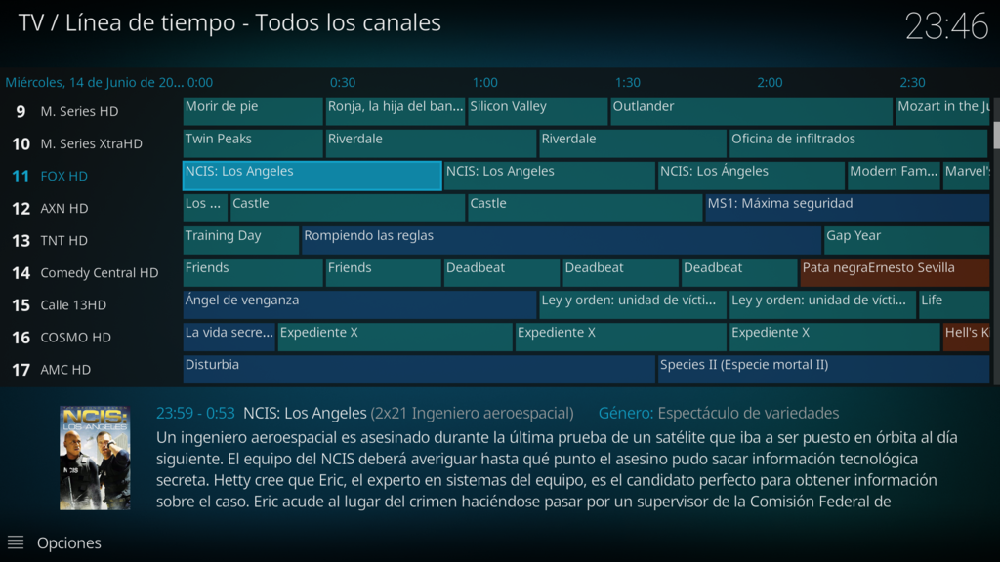
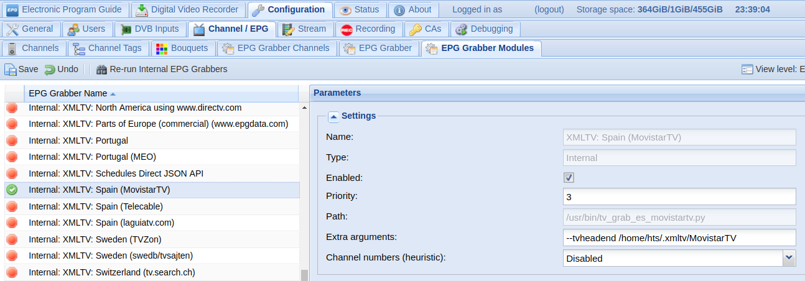
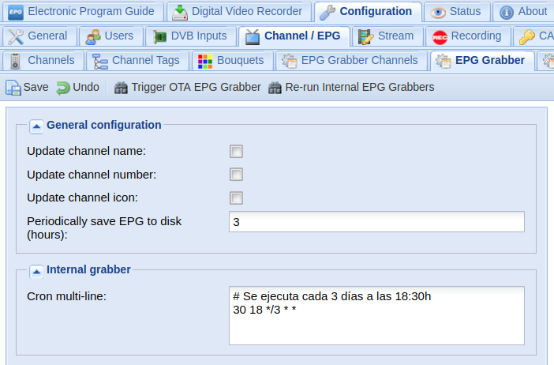

# tv_grab_es_movistartv

Grabber XMLTV para el servicio de Televisión IPTV de Movistar España.

Genera la guía *EPG* en formato _XMLTV_ y la _lista de canales_ en formato _M3U_ a partir de los datos 
suministrados por el operador vía multicast.

Se integra con TVHeadend.



##### Requisitos:

* Servicio de Movistar TV correctamente configurado (DNS `172.26.23.3` y rutas correspondientes).
* Funciona tanto por Wifi como por Ethernet, pero mejor por cable.

#### Características

* Un solo archivo
* No necesita configuración: la descarga del proveedor de servicios
* Genera la guía y la lista de canales de los paquetes contratados
* Descarga la guía EPG multicast de varias IP simultáneamente para reducir el tiempo de ejecución
* Descarta los programas finalizados para no sobrecargar los servidores del operador
* Los títulos y subtítulos siguen los esquemas `Título de la serie` y `1x01 Título del episodio` respectivamente
  (en caso de película el año se establece como subtítulo)
* Guía EPG coloreada (géneros adaptados a TVHeadend)
* Mantiene una caché con todos los datos descargados (se autolimpia pasados unos días y se puede resetear)
* Mantiene un registro configurable de los eventos que suceden durante la ejecución del script
* En caso de fallo de conexión se usan parámetros por defecto que se pueden personalizar
* Se utilizan todos los EndPoint disponibles y en caso de fallos reiterados 
  los añade a una lista negra
* En caso de fallo del conjunto de EndPoints se descarga una guía básica
* Licencia GPLv3

#### Opciones

Argumentos que acepta el programa:
```
usage: tv_grab_es_movistartv [-h] [--description] [--capabilities]
                             [--output FILENAME] [--m3u OUTPUT]
                             [--tvheadend CHANNELS] [--reset]

Grab Movistar TV EPG guide via Multicast from 10/06/2017 to 14/06/2017

optional arguments:
  -h, --help            show this help message and exit
  --description         Show 'Spain (MovistarTV)'
  --capabilities        Show xmltv capabilities
  --output FILENAME     Redirect the xmltv output to the specified file.
                        Otherwise output goes to stdout.
  --m3u OUTPUT          Dump channels in m3u format to the specified file.
  --tvheadend CHANNELS  Grab EPG and dump channels in m3u format to CHANNELS
                        file (use this argument in TVHeadend grabber's
                        configuration page to update both: the EPG guide and
                        the m3u channel list)
  --reset               Delete saved configuration, log file and caches.
```

##### Ejemplos:

Vuelca la guía EPG en un archivo XML:
```bash
$ tv_grab_es_movistartv --output /home/hts/guia.xml
```

Genera la lista de canales:
```bash
$ tv_grab_es_movistartv --m3u /home/hts/MovistarTV
```

Actualiza la EPG y la lista de canales en TVHeadend:
```bash
$ tv_grab_es_movistartv --tvheadend /home/hts/MovistarTV
```

#### Configuración

Edita el programa con vi, nano, gedit, kedit... y cambia los parámetros de configuración según tus necesidades:
```
default_demarcation = demarcations['Asturias']

app_dir = '/home/hts/.xmltv'
use_multithread = True
cache_exp = 3  # Días

log_file = 'tv_grab_es_movistartv.log'
log_level = logging.INFO
log_size = 5  # MB

cookie_file = 'tv_grab_es_movistartv.cookie'
end_points_file = 'tv_grab_es_movistartv.endpoints'
```

Los más importantes son `default_demarcation` y `app_dir`:

* `default_demarcation`: cambia `'Asturias'` por el nombre de tu provincia (ver diccionario `demarcations`)
* `app_dir`: si cambias la ruta por defecto asegúrate de que TVHeadend tiene permisos de escritura en la nueva ruta

#### Integración en TVheadend

Mueve el script a /usr/bin y cambia el propietario y los permisos:
```bash
$ sudo mv tv_grab_es_movistartv.py /usr/bin/tv_grab_es_movistartv
$ sudo chown root:root /usr/bin/tv_grab_es_movistartv
$ sudo chmod 755 /usr/bin/tv_grab_es_movistartv
```

Reinicia y ve a la interfaz web de TVHeadend:



En `Configuration -> Channel / EPG -> EPG Grabber Modules` activa el grabber `Internal XMLTV: Spain (MovistarTV)` 
y pon como argumento: `--tvheadend /home/hts/.xmltv/MovistarTV`

Ve a `Configuration -> Channel / EPG -> EPG Grabber`:



Sustituye el contenido de `Cron multi-line` por:
```
# Se ejecuta todos los días a las 22:30h
30 22 * * *
```

Y guarda los cambios.

### Autor

Escrito por _ _WiLloW_ _

###### Basado en movistartv2xmltv by ese:
* [https://github.com/ese/movistartv2xmltv](https://github.com/ese/movistartv2xmltv)

###### Mil gracias a Gomer por haber dado la clave para descifrar el nuevo formato:
* [https://www.adslzone.net/postt359916-135.html#p2985166](https://www.adslzone.net/postt359916-135.html#p2985166)
