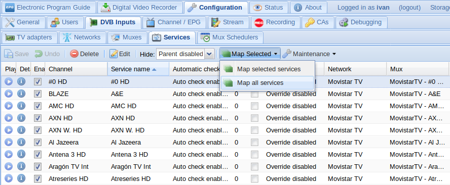

# tv_grab_es_movistartv

Grabber XMLTV para el servicio de Televisión IPTV de Movistar España.

Genera la guía *EPG* en formato _XMLTV_ y la _lista de canales_ en formato _M3U_ a partir de los datos suministrados por el operador vía multicast.

Se integra con TVHeadend.


## Requisitos:

* Servicio de Movistar TV correctamente configurado (DNS `172.26.23.3` y rutas correspondientes).
* Funciona tanto por Wifi como por Ethernet, pero mejor por cable.

### Características

* Un solo archivo
* No necesita configuración: la descarga del proveedor de servicios
* Genera la guía y la lista de canales de los paquetes contratados
* Descarga la guía EPG multicast de varias IP simultáneamente para reducir el tiempo de ejecución
* Descarta los programas finalizados para no sobrecargar los servidores del operador
* Los títulos y subtítulos siguen los esquemas `Título de la serie` y `1x01 Título del episodio` respectivamente
  (en caso de película el año se establece como subtítulo)
* Guía EPG coloreada (géneros adaptados a TVHeadend)
* Mantiene una caché con todos los datos descargados (se autolimpia pasados unos días y se puede resetear)
* Mantiene un registro configurable de los eventos que suceden durante la ejecución del script
* En caso de fallo de conexión se usan parámetros por defecto que se pueden personalizar
* Se utilizan todos los EndPoint disponibles y en caso de fallos reiterados 
  los añade a una lista negra
* En caso de fallo del conjunto de EndPoints se descarga una guía básica
* Licencia GPLv3

### Opciones

Argumentos que acepta el programa:
```
usage: tv_grab_es_movistartv  [-h] [--description] [--capabilities] [--output FILENAME]
                              [--m3u OUTPUT] [--tvheadend CHANNELS] [--reset]
                              [--demarcation_list] [--demarcation DEMARCATION]
                              [--disable_multithread] [--threads THREADS]
                              [--max_credits MAX_CREDITS] [--cache_exp CACHE_EXP]
                              [--udpxy UDPXY]

Grab Movistar TV EPG guide via Multicast from 17/04/2020 to 21/04/2020

optional arguments:
  -h, --help            show this help message and exit
  --description         Show 'Spain (MovistarTV)'
  --capabilities        Show xmltv capabilities
  --output FILENAME     Redirect the xmltv output to the specified file.
                        Otherwise output goes to stdout.
  --m3u OUTPUT          Dump channels in m3u format to the specified file.
  --tvheadend CHANNELS  Grab EPG and dump channels in m3u format to CHANNELS
                        file (use this argument in TVHeadend grabber's
                        configuration page to update both: the EPG guide and
                        the m3u channel list)
  --reset               Delete saved configuration, log file and caches.
  --demarcation_list    Show list demarcation
  --demarcation DEMARCATION
                        Select demarcation, show list all demarcations with
                        the option --demarcation_list.
  --disable_multithread
                        Disable the use multithread in the process of get the
                        info.
  --threads THREADS     Set the number threads, default 3.
  --max_credits MAX_CREDITS
                        Maximum number of actors/directors to be shown in the
                        credits list, default 4.
  --cache_exp CACHE_EXP
                        Number of days the cache expires, default 3.
  --udpxy UDPXY         When generating the channel list the udpxy server will
                        be added in the address. udpxy example
                        "192.168.0.1:4022"

```

### Ejemplos:
**Aviso:** Deberemos especificar el argumento `--demarcation` para obtener los datos de la regios que deseamos. Para obtener la lista de regiones usaremos el argumento `--demarcation_list`.

Lista de regiones:
```bash
$ tv_grab_es_movistartv --demarcation_list
```

Vuelca la guía EPG en un archivo XML:
```bash
$ tv_grab_es_movistartv --demarcation Madrid --output /home/hts/.xmltv/guia.xml
```

Genera la lista de canales:
```bash
$ tv_grab_es_movistartv --demarcation 'Castilla y Leon' --m3u /home/hts/.xmltv/MovistarTV
```

Actualiza la EPG y la lista de canales en TVHeadend:
```bash
$ tv_grab_es_movistartv --demarcation Navarra --tvheadend /home/hts/.xmltv/MovistarTV
```

### Configuración

Edita el programa con vi, nano, gedit, kedit... y cambia los parámetros de configuración según tus necesidades:
```
app_dir = '/home/hts/.xmltv'

log_file = 'tv_grab_es_movistartv.log'
log_level = logging.INFO
log_size = 5  # MB

cookie_file = 'tv_grab_es_movistartv.cookie'
end_points_file = 'tv_grab_es_movistartv.endpoints'
```

Lo más importante es `app_dir`:
* `app_dir`: si cambias la ruta por defecto asegúrate de que TVHeadend tiene permisos de escritura en la nueva ruta

### Integración en TVheadend

Mueve el script a /usr/bin y cambia el propietario y los permisos:
```bash
$ sudo mv tv_grab_es_movistartv.py /usr/bin/tv_grab_es_movistartv
$ sudo chown root:root /usr/bin/tv_grab_es_movistartv
$ sudo chmod 755 /usr/bin/tv_grab_es_movistartv
```

Reinicia y ve a la interfaz web de TVHeadend:


En `Configuration -> Channel / EPG -> EPG Grabber Modules` activa el grabber `Internal XMLTV: Spain (MovistarTV)` y pon como argumento: `--tvheadend /home/hts/.xmltv/MovistarTV`

Ve a `Configuration -> Channel / EPG -> EPG Grabber`:


Sustituye el contenido de `Cron multi-line` por:
```
# Se ejecuta todos los días a las 22:30h
30 22 * * *
```

Y guarda los cambios.

### Solución de problemas

#### - No se ven los logos de los canales en Kodi

Movistar ha cambiado las URI de los logos de los canales al menos en una ocasión. Si has actualizado el 
grabber y aún así no se ven los logos en Kodi, sigue estos pasos:

Borra la caché del grabber:
```bash
$ sudo tv_grab_es_movistartv --reset
```

Regenera la lista de canales (cambia el usuario y la ruta según tu configuración):
```bash
$ sudo -u hts tv_grab_es_movistartv --demarcation Navarra --m3u /home/hts/.xmltv/MovistarTV
```

Ve a la lista de canales de la interfaz web de TVHeadend en `Configuration -> Channel / EPG -> Channels`, 
selecciónalos todos y bórralos pulsando `Delete`:


Ahora ve a la lista de Servicios en `Configuration -> DVB Inputs -> Services` y vuelve a mapearlos pulsando 
en `Map all services`:



Reinicia Kodi. Si siguen sin verse ve a la configuración de Kodi y borra los datos de la TV en `Configuración -> Ajustes de PVR y TV en directo -> General -> Borrar datos`:


Ve a la lista de canales y comprueba que ya se ven.

#### - Error al descargar los archivos XML: timed out

La descarga de la guía básica que viene por Multicast es multihilo, se conecta a varias IP simultáneamente para agilizar el tiempo de ejecución del grabber. Por defecto hay tres hilos (tres conexiones a tres IP diferentes) porque a partir de cuatro he notado que pueden aparecer errores de este tipo.

Si es tu caso, baja el número de conexiones a dos: 
```bash
$ tv_grab_es_movistartv --demarcation Navarra --threads 2 --tvheadend /home/hts/.xmltv/MovistarTV
```

Si sigues teniendo problemas desactiva el multihilo: 
```bash
$ tv_grab_es_movistartv --demarcation Navarra --disable_multithread --tvheadend /home/hts/.xmltv/MovistarTV
```

## Autor

Escrito por _ _WiLloW_ _
Actualizado por VSC55


### Basado en movistartv2xmltv by ese:
* [https://github.com/ese/movistartv2xmltv](https://github.com/ese/movistartv2xmltv)

### Mil gracias a Goomer por haber dado la clave para descifrar el nuevo formato:
* [https://www.adslzone.net/postt359916-135.html#p2985166](https://www.adslzone.net/postt359916-135.html#p2985166)
